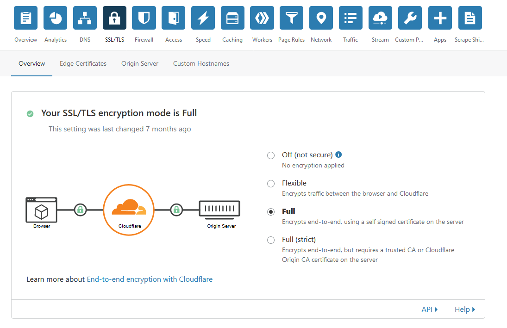
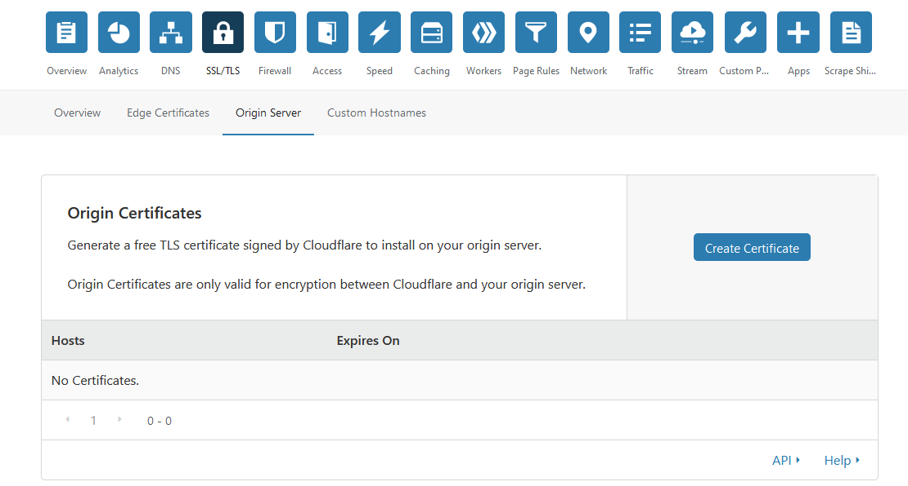

## nginxとCloudFlareのSSLの組み合わせ方

### 方法1 snakeoilとFullを組み合わせる
Debian/Ubuntuなんかは簡単に自己署名が発行できるのでそれと組み合わせる

nginx側ではDebian/Ubuntuの自己署名証明書を設定して
```
ssl_certificate     /etc/ssl/certs/ssl-cert-snakeoil.pem;
ssl_certificate_key /etc/ssl/private/ssl-cert-snakeoil.key;
```
該当ファイルがなければ`sudo apt install ssl-cert`で入れられる

CloudFlare側ではmodeとしてFullを選択する  



### 方法2 origin certificateとFullを組み合わせる
CloudFlareで発行してくれる CF<=>origin用の証明書を使う

CloudFlareでorigin certificateを発行する  


発行したcertificateをnginx側にインストール＆設定する

CloudFlare側ではmodeとしてFullを選択する  


※ 厳密に照合したい場合はFull (strict)も選択できるが、他のoriginサイトがある場合そちらにもちゃんと証明書を設定する必要があるので注意


